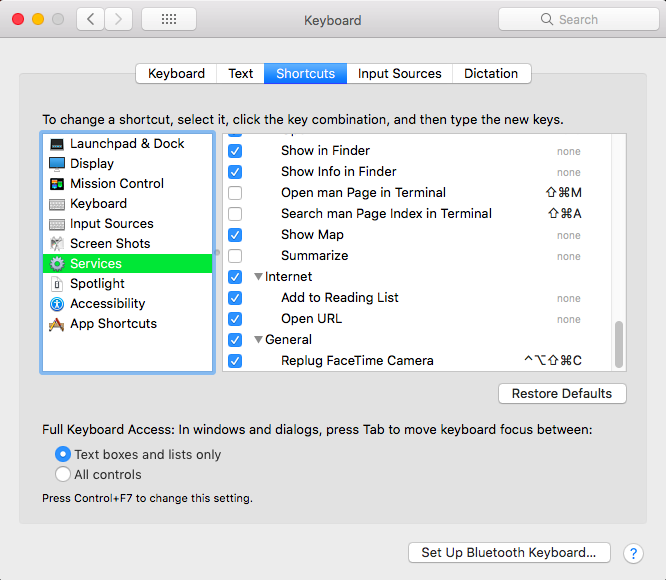

# FaceTime Camera and Desktop Virtualization Solutions

I am often using my MacBook Air 13" (mid-2012) as my BYOD device of choice to connect remotely
to a corporate virtual desktop via various virtualization platforms (such as VMWare Horizon
or Citrix Workspace or Parallels).

However I was surprised and, at some point frustrated, when I noticed that once you launch your
virtualization client, you cannot use FaceTime camera anymore: FaceTime (or any other software
using the camera, such as Zoom or Skype) opens just fine, but the small green camera light stays
off and the signal from camera is just pitch-black. Even when you close your remote client,
the camera functionality does not return back to normal. And even restarts don't help - you will
have to reset SMC (System Management Controller): shut down the Mac and press simultaneously
**⌃ + ⌥ + ⌘ + Power** keys to make camera work again. And, needless to say, this works only
up until the moment when you start your virtualization client again.

So I was really annoyed that I could not use Zoom with video for work while sharing my screen
at the same time.

And one day I found the solution to be able to fix the camera issue with one single shortcut.

The secret ingredient to my solution is [this article on StackExchange](https://unix.stackexchange.com/questions/367951/camera-not-working-on-macos-sierra-and-high-sierra).
It looks like camera issue is related to a bug in handling USB connections (which the virtualization
clients seem to fiddle with) and hence the workaround that one could think of - just programmatically
re-plug the camera. The source code and compiled binary can be found in [this Git repo](https://github.com/dskr99/mac_usb_eject).

So, here we go.

1. Clone the git repo into your local directory (change the paths accordingly):
    ```bash
   git clone https://github.com/dskr99/mac_usb_eject
    ```
   
2. Check that the binary file is in place (you can also build it yourself by running `make` inside the
   source directory `mac_usb_eject/replug_facetime`):
    
   
3. Update the `/etc/sudoers` file to add ability for your user to run this program via sudo without 
   asking for a password each time (e.g. run `sudo vim /etc/sudoers`). There should be a line similar 
   to this:
   
   
4. Check that the command runs successfully, and the password dialog does not appear:  
   ```bash
   sudo ~/Git/github.com/dskr99/mac_usb_eject/bin/replug_facetime
   ```
   
5. Let's use **Automator** to automate calling this binary. Open **Spotlight Search** area and find
   **automator.app** and run it. Press **⌘ + N** to create new automation **Service**:
   
   
6. From the left-hand pane in **Actions** library choose **Run Shell Script** and drag-and-drop it
   to the left pane and paste the command from step #4 into the script contents. Also, select
   **no input** for **Service receives** value and enable **Ignore this action's input** in
   **Options**:
   

7. Then save the workflow (**⌘ + S**) as e.g. **Replug FaceTime Camera** in Automator.

8. Open **System Preferences -> Keyboard -> Shortcuts** and choose **Services**. Found down below our
   new automation service **Replug FaceTime Camera**, enable it and add shortcut of your choice:
   

9. Voilà! Now everytime you find that camera is not working - just press your combination and
   restart the application that requires the camera (FaceTime, Skype or Zoom).
